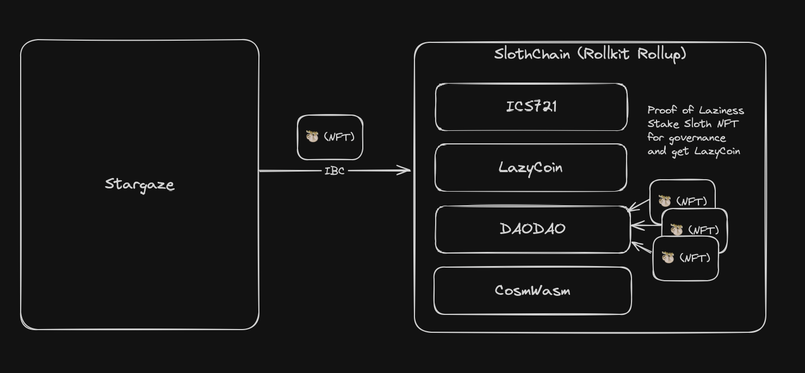

# SlothChain 🦥

LM 🦥💤

Forked from Wasmd and changed to Rollkit (https://rollkit.dev/tutorials/cosmwasm).

For a production version of this we will obviously add Wasmd as a normal dependency rather than forking it.

## How is SlothChain Lazy?

SlothChain is meme chain. The goal is to make it very memey. It is a chain for the lazy ones.

It is implemented as a Rollkit chain, with CosmWasm and some contracts such as DAODAO to make it useful.

## Running the chain
There are some pre-requisits for running the chain, most of them you can find in the rollkit tutorial linked above, but as a quick summary:
* Go
* Docker
* Rust with the wasm setup
* You need to have the celestia light client for mocha running (`celestia light start --core.ip rpc-mocha.pops.one --p2p.network mocha`).
    * You can find instructions for how to set up the celestia light client here: https://docs.celestia.org/nodes/light-node

You can run the chain with `./init.sh` which will build the chain and start it up (fresh every time).

If you stop the chain and want to restart it, you can use the `./restart-slothd.sh` which is created after the first run.

### Sloth NFTs
The Celestine Sloth Society NFTs (just called "Sloths" from here on) are currently on Stargaze.
With IBC and ICS721 they can be transferred to any chain. Such as SlothChain.

The Sloths are lazy, they don't do much. They just hang around and occasionally do something. They are not very useful, but they are cute.

Also, they can be used for governance:

### "Proof of Laziness💤"
Governance is controlled by the lazy ones. The chain has DAODAO where you can stake your Sloth to participate in governance.

"Proof of Laziness💤" should also get you LazyCoin or something, but this is not fully implemented yet.

(As a side not: we could implement a simple contract that swaps Sloths for LazyCoin at a constant rate, but this has not been implemented yet)

### DAODAO
There is a script, `scripts/build-lazy-stuff.sh` for building DAODAO, 
uploading all the contracts to a running chain (running locally with the `./init.sh` script).

At the end it outputs a typescript structure that is necessary for the DAODAO UI (it goes in the `dao-dao-ui/packages/utils/constants/chains.ts` file). 
The UI is not fully working yet for the sloth chain, so some more work is needed.

### The chain itself is lazy
* The logger has sloths in the formatting: `🦥 2:37PM INF starting node with Rollkit in-process`
* The chain is running with the Rollkit lazy aggregator, so it only creates blocks when there are transactions
* The base token is `ulazy`

### Future plans
If we get some funding to actually see this project through I would like to:
* Add a bunch of stupid memey things to the chain like sloth emojies everywhere, slower blocks, etc (just really lean into the lazy theme)
* Make this a fun governance project where the Sloth community can come together and own something (lazily, of course)
* Put some serious degen stuff in here, but make it lazy somehow. Maybe some crosschain stuff can make this happen.
* Just more fun stuff, really. Fun, lazy and memey.